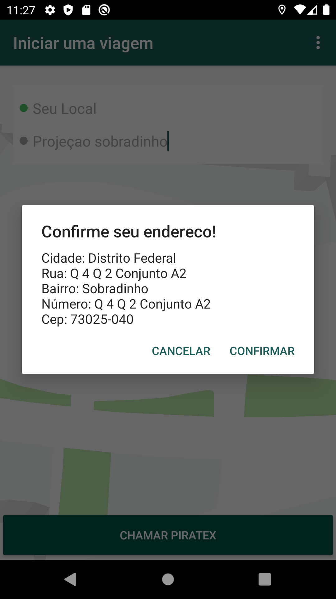

# Piratex

<p float="left" align="center">
  
  
  
</p>

[](https://www.linkedin.com/in/kadson-jader-martins-ferreira-69463731/)

 

_Sistema de aplicativo movel de carona compartilhada_

## Tecnologias Usadas
Tecnologias usadas para a estrutura dessa parte do projeto
```sh
Java
Android SDK
Google maps API
```
## Getting Started
clone o repositorio e executa com algumas dessas IDE
```sh
Android Studio
```

## Contato

Kadson Jader - [Github](https://github.com/kadsonjader) - **kadsonj@hotmail.com**
